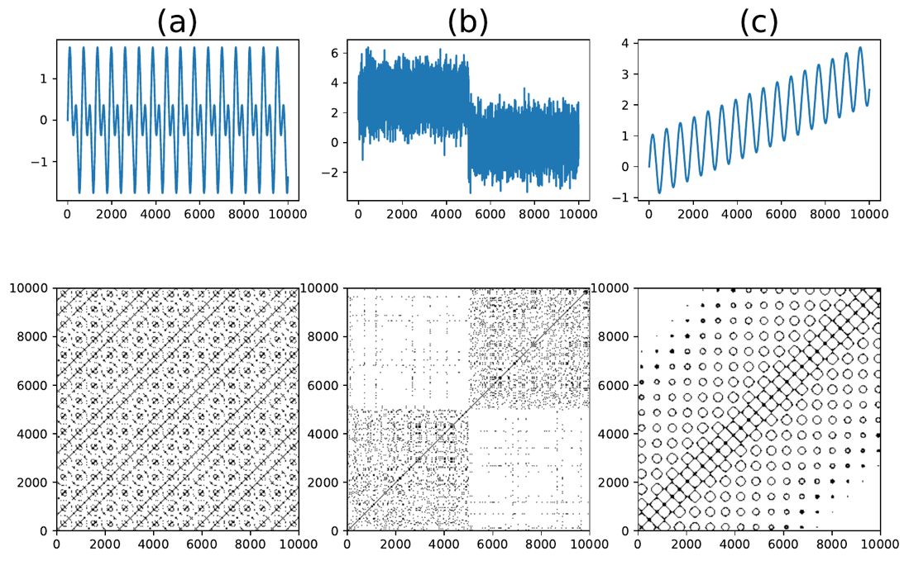
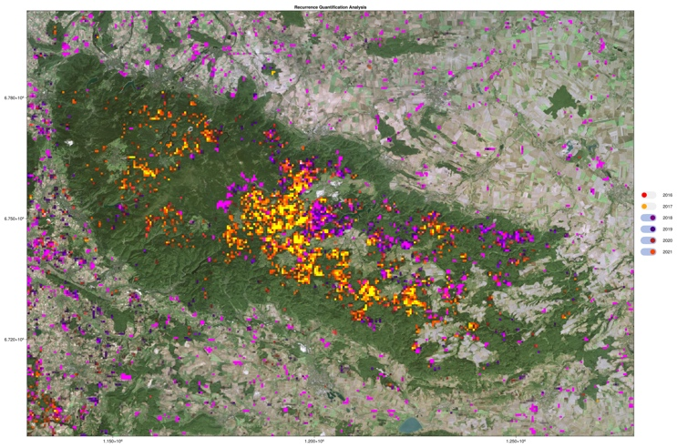
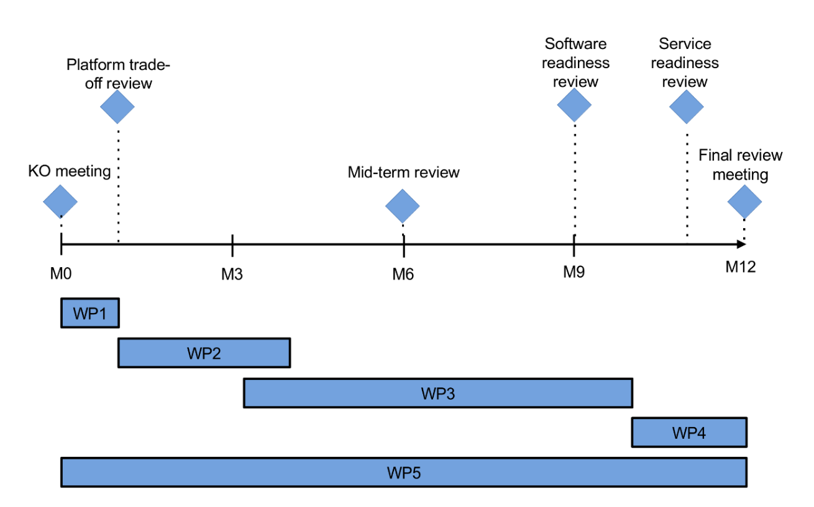

### 

FAIR workflows for Sentinel-1 based  
Deforestation Detection

**MID TERM REPORT**

presented by  
Daniel Loos, Felix Cremer, Gregory Duveiller and Fabian Gans

from the  
Max Planck Institute for Biogeochemistry

as part of the ESA initiative

Science Result Long-Term Availability & Reusability Demonstrators

in ESA contract  
4000144670/24/I-EB

from 4 September 2024 to 4 September 2025  
as of 15 March 2025

# Abstract

# Executive Summary

-Brief overview of the project objectives.
-Summary of progress and key findings.
-Highlight any significant achievements or milestones.
-Kick off meeting
-Created OGC application package (container, CWL)
-Optimized compiling and memory allocations
-Submitted Talk to Living Planet Symposium

# Introduction

## Background

-Science builds on previous results

- This requires work flows to to be FAIR so they can be extended and
  re-used by others
- Implementing the algorithm alone is not sufficient
- Long-term avaibility needced
- EarthCODE is currently building a portal to host scientific workflows build by FAIR principles
- Importance and relevance to the space agency's mission
- Regulation on Deforestation-free Products (EUDR) guarantees that products consumed by EU citizens don't contribute to deforestation or forest degradation worldwise [(Eu comission 2023)](https://environment.ec.europa.eu/topics/forests/deforestation/regulation-deforestation-free-products_en). This requires freely accessible monitoring tools to detect forest change.

## Objectives

-Make an initial algorithm implementation FAIR

# Methodology

## Initial implementation

Forests play an important role in the carbon, water and energy cycles,
thereby interacting with climate through both biogeochemical and
biophysical mechanisms (Bonan 2008). They also provide a series of
ecosystem services to human populations in addition to materials such as
wood, food, fuel and fiber, plus they harbour vast reservoirs of
biodiversity. Changes in the forest cover, and particularly those
generating forest cover loss, are particularly important to monitor to
ensure policies can be enforced to maintain the sustainability of these
ecosystem services provided by forests. Analysing satellite imagery is a
feasible and objective way to quantify the extent of deforestation.
Unlike optical imaging, Synthetic Aperture Radar (SAR) technology allows
to detect deforestation in cloudy ecosystems like rain forests as well.
However, forest properties depend drastically on the biome, making it
challenging to apply the same algorithm globally. Compared to the
analysis of individual scenes, the detection accuracy can be increased
by analysing an entire time series for single locations at once (Cremer
et al. 2020). This means the dataset is not seen and analysed as a
collection of images but rather as a collection of single-pixel time
series. However, analysing data which is archived as individual images
in a timeseries-first manner imposes some technical requirements on the
processing engine, including very efficient memory management. In the
past the consortium had good experiences using the YAXArrays.jl toolbox
for complex pixel-based time series analysis on large EO which is why
the mature scientific experiment was implemented in the Julia
programming language and using YAXArrays.jl for scaling the computation
and IO.

We used RQA to generate an indicator of change in the Sentinel-1 time
series. This change indicator is computed for the time series of every
pixel separately and therefore follows the “time first space later”
approach. The Recurrence Quantification Analysis is based on the
recurrence plot technique, which was first described in
\\cite{Eckstein}. The recurrence plot is derived by comparing every
pairwise combination of time steps in the time series according to some
similarity measure. This leads to a quadratic binary matrix with true
values indicating that two timesteps are similar, while false values
indicate they are distinct. Figure 2 shows example time series and their
respective recurrence plots.

Figure2: Recurrence Plots for (a) the sum of two sine waves with
different frequencies, (b) a step function with noise, and (c) a sine
wave with trend. The upper row shows the raw example time series and the
lower row the corresponding recurrence plot

From the recurrence plot of a time series we can derive different RQA
metrics that describe the behaviour of the time series. The metric that
is used in this project for the detection of change in the behaviour of
the Sentinel-1 time series is the Trend. The RQA Trend represents the
linear regression coefficient of the recurrence rate along a diagonal in
comparison to the distance to the main diagonal. Therefore, it indicates
how much the likelihood of two timesteps being similar depends on their
temporal distance.

The methodology has been validated on small scales and we compared
against a simple threshold approach on the range between the 95thto
5thpercentile. We showed that the RQA Trend and the percentile range
have a similar detection rate of deforestation in a single year, but
that the percentile range of a deforestation event from previous years
can have similar values to a new deforestation which is not the case for
the RQA Trend metric (Cremer et al. 2020).

Figure3: Detected Deforestation events and their timing (Cremer et al. 2023)

In the scope of a use case of the C-Scale Horizon 2020 project we
computed the RQA Trend metric for the whole continent of Europe for the
years 2018 to 2021 (Cremer et al. 2023). During these activities we
reduced the memory usage and thereby the runtime of the algorithm. This
was achieved by improving the algorithm to compute the RQA Trend metric
directly without having to store the underlying recurrence matrix in
memory. These improvements have been possible because the complete data
analysis was implemented in Julia and therefore a change in the
underlying analysis package did not involve changing the programming
language. The data analysis was parallelized using the YAXArrays.jl
package that is developed under the JuliaDataCubes organisation. The
analysis code is available under a MIT License to be aligned with
open-science principles. The output of the scientific experiment are in
Zarr data format. An introduction to the method and the software stack
is available at Large-scale EO data handling – [EO College
(eo-college.org)](https://eo-college.org/resource/large-scale-eo-data-handling/)

## Julia Package

-https://github.com/EarthyScience/RQADeforestation.jl

## OGC Application Package

-Takes Julia package, puts them into docker container, puts them into
cwl workflow

# Implementation status

-Done: WP1 and WP2
-Ongoing: WP3, WP5

## WP1: Selection of operational NoR EO Platform services

Expected: done  
Actual: done

Tasks
-Finalise technical requirements of the existing deforestation
detection software and its planned improvements
-Analyse trade-offs between available platforms
-Identify and select a suitable platform in NoR to run the workflow
-Identify and select an external expert for technical code review
-Prepare a cost estimation
-Submit NoR sponsoring request
-Create a presentation about the trade-off analysis and the selected
providers

Select cloud provider
-Must has S-1 Sigma0 (reprocessing would increase time overhead too
much)
-Focus on VMs with many CPU cores, &gt; ~160GB RAM (Embarrassingly
parallel workflow)
-Low price
-Reviewed: EODC, CloudFerro, T-Systems
-Selected: EODC

- Offers FAIR Sigma Nought datasets

- But: Access will cost for future commercial uses

- Data access faster than CDSE for time series (less tile overlap
  in Equi7Grid)

- Cheap VM offer

- Many collaborations with academia (e.g. Technical University of
  Vienna)

- Assured payment processing for future users

- Known file structure

- Successful collaboration in the past

Select code review expert
-Must have expertise in Julia and data access
-Challenge: Julia experts are rare, e.g., no result in official NoR
portfolio
-Reviewed: APEX, cloudflight, jolin.io
-Selected: Stephan Sahm, jolin.io

- Jolin.io is specialized in Julia consulting

- Founder is maintainer of many Julia packages

- Only consultant specialized on data access using Julia

- Proven record in Julia development on GitHub
  -Got offer, contract via ad-hoc NoR sponsorship
  -Jolin.io did light tier registration at NoR, expanding its portfolio
  with Julia code review

Submitted deliverables
-D01: Trade-off analysis presentation for platform selection and code
review including cost estimation

<!-- -->

-D02: NoR sponsoring request document

## WP2: End-to-end FAIR Workflow

Expected: done

Actual: done

### 2.1 Set up working environment

-Identify public repositories to store code, software containers, and
custom data and select the best one according to FAIR principles

- Main repo: https://github.com/EarthyScience/FAIRSenDD

  - GitHub is the biggest platform to host open-source software, making the code findable and accessible.
  - git is the de facto standard version control system, allowing interoperability.

- dockerhub
  -Create a custom example dataset with correct annotations to test the
  deforestation software

- [https://github.com/meggart/RQADeforestationTestData](https://github.com/meggart/RQADeforestationTestData)
  -Setup CI/CD infrastructure

- [https://github.com/EarthyScience/FAIRSenDD/tree/main/.github/workflows](https://github.com/EarthyScience/FAIRSenDD/tree/main/.github/workflows)

- [https://github.com/EarthyScience/RQADeforestation.jl/tree/main/.github/workflows](https://github.com/EarthyScience/RQADeforestation.jl/tree/main/.github/workflows)

- Terraform for openStack for VM deployment

### 2.2 Make workflow FAIR

-FAIR Principles promote Findability, Accessibility, Interoperability, and Reuse of digital assets [Wilkinson et al 2016](https://www.nature.com/articles/sdata201618)

- originally used in the context of scientific data
- This project is about software development in which the terms open-source and free software are more common which focus on the freedom to use and improve the software.
- FAIR principles extend these principles on interoperability and reusability so that improvement is not only allowed but also encouraged and simplified.
- This is done by using well-established open standards.
  -we chose MIT licence, ensuring free use including commercial one. This also fits well in the license ecosystem of most Julia packages.
  -Export deforestation events as a Zarr Data Cube according to the xcube specification
  - RQADeforestation.jl uses YAXArrays.jl that uses zarr by default
- Describe output with STAC metadata

  - added staging out procedure that uploads the result data with its own STAC catalog as static JSON files as recommended by [OGC Best Practice for Earth Observation Application Package](https://docs.ogc.org/bp/20-089r1.html#toc27)
    -Develop the CWL file and docker images describing the entire
    workflow using OGC Best Practice for Earth Observation Application
    Package

  - Added CWL workflow [here](https://github.com/EarthyScience/FAIRSenDD/tree/main/ogc-app-cwl)
  - Docker images are build on CI at RQADeforestation (danlooo/fairsendd_rqa, danlooo/fairsendd_stage_out, and danlooo/julia_package_compiler_dev)
    -Create unit tests for the individual functions and integration tests
    for the entire workflow

  - We used [TestItemRunner.jl](https://github.com/julia-vscode/TestItemRunner.jl) to put tests directly next to the function, results displayed within
    VSCode

  - Integration test that runs the main function on the real world test dataset [meggart/RQADeforestationTestData](https://github.com/meggart/RQADeforestationTestData) on every code change as part of the CI test workflow.
    -Ensure data formats comply well with the ones used in the EarthCODE community and FAIR principles
  - Add meta data about code, authors and license according to FAIR Application Packages recommendation [(terradue 2023)](https://terradue.github.io/app-package-training-bids23/).
  - added codemeta.json, AUTHORS, MIT LICENSE
  - OGC Application Package suitable for future publishing in Open Science Catalog of EarthCODE, like the [POLARIS example](https://opensciencedata.esa.int/workflows/polaris-workflow/record)

### 2.3 Document workflow

-Create and host FAIR, standardized, and well-structured source code
documentation

- we created the website http://fairsendd.eodchosting.eu/ hosting the documentation and APIs
- code to generate the documentation is published under MIT license at the [FAIRSenDD repository](https://github.com/EarthyScience/FAIRSenDD/tree/main/website)
- code examples are executed during documentation build as Quarto notebooks ensuring reproducibility of the documentation.
- Specific documentation about functions of the underlying Julia package RQADeforestation.jl using Documenter [here](https://earthyscience.github.io/RQADeforestation.jl/dev/)
  -Write a user tutorial including an easy-to-read summary of the
  theory, assumptions, links to published papers, and methods, code on
  how to execute the example, as well as a description and
  implications of user-defined parameters enabling parameter tuning

- Tutorials on how to run the Julia package, the CWL workflow and the OGC API
- Summary of the scientific background including description of the parameters
- keep in mind that the documentation will probably change during the course of WP3: Code performance enhancement & Cloud platform integration

Deliverables
-D03: Online documentation for developers and users about the theory,
user parameters, examples and the underlying code

## WP3: Code performance enhancement & Cloud platform integration

Expected: Halfway done  
Actual:

### 3.1 Enhance workflow code

-Perform external code review and refactoring

- Reduced allocations

- Created compiled stand alone sysimage using PackageCompiler.
  Binaries in github artefacts, binaries used in docker container
  -Define a list of KPIs to track algorithm performance

- [https://github.com/EarthyScience/RQADeforestation.jl/issues/49](https://github.com/EarthyScience/RQADeforestation.jl/issues/49)
  -Identify performance bottle-necks
  -Evaluate improvement solutions of the workflow
  -Enhance the performance of the workflow
  -Create software package compliant to OGC “Best Practice for Earth
  Observation ApplicationPackage (OGC 20-089)"
  -Release the updated workflow using the CI/CD pipeline with
  persistent identifiers
  -Demonstrate software readiness
  -Develop a Web GUI prototype to run the workflow

### Benchmark current status

KPIs defined in progress meeting 3 Jan 2025:
-number of implemented algorithms &gt;= 2 (e.g. rqatrend, quantile)
-time to first response of a minimum working example &lt;10s.
Measures userfriendliness and overhead
-Classification performance on a benchmark dataset (accuracy,
sensitivity, specificity)
-number of allocations of the rqatrend inner function: required to
embed in openEO python UDF, helps Julia garbage collector in
controlling memory usage
-code coverage with unit tests: Do not make a mistake twice in
further software versions analysis time per computing resources

<table>
<thead>
<tr class="header">
<th>KPI</th>
<th>before</th>
<th>after</th>
</tr>
</thead>
<tbody>
<tr class="odd">
<td>Container start up time [s]</td>
<td></td>
<td></td>
</tr>
<tr class="even">
<td>Allocations on test dataset</td>
<td></td>
<td></td>
</tr>
<tr class="odd">
<td>Code coverage</td>
<td></td>
<td></td>
</tr>
</tbody>
</table>

### 3.2 Explore deployment improvements

-Explore ways to extend openEO to be able to run user defined
functions using Julia or Docker images

Deliverables
-D04: Code review and optimization report
-D05: Software Specification Document (SRD)
-D06: Software Verification and Validation (V&V) document

## WP4: Deployment as on-demand operational service

Expected: Start in the future  
Actual: Start in the future
Deliverable: D07: Service Verification & Validation document
-Negotiate pricing model with the platform provider
-Create the price calculator given user-defined parameters, e.g.
bounding box and time spans and document the price per unit of area
and time span
-Deploy the workflow on the host platform linking workflow code,
metadata and documentation
-Determine corresponding authors and code maintainers to ensure user
support
-Organise the Service Readiness Review

## WP5: Project Coordination and Cooperation

Expected: Ongoing
Actual: Ongoing

Objectives:
-Ensure a smooth day-to-day management of the project
-Guarantee the timely submission of deliverables
-Ensure smooth execution of the project, on schedule, and within
budget
-Organise progress and final meetings
-Communicate the progress of the project to ESA

Done:
-Biweekly meetings
-Every second meeting: with ESA TO
-Stephan Sahm from jolin.io joined meetings during WP3 to discuss
code enhancements

# Challenges and Solutions

-Any obstacles encountered and how they were addressed.
-Impact of these challenges on the project timeline or outcomes.
-Multi step CWL vs one step CWL

## Overhead for small data sets

-Overhead: loading (meta) data and code to memory

- Time to ask the OS to get a single file is const. regardless of file size
- Execution time of function rqatrend could be lowered drastically for a single time series, but not on a bigger dataset
- Data loading procedure was optimized for bigger datasets after v0.1
- see https://github.com/EarthyScience/RQADeforestation.jl/issues/89
- starting a docker container takes ~0.5s, adding overhead to the CWL workflow. We get interoperability and reproducibility in return.

## Complexity in rendering polyglot notebooks

-Interoperability requires to demonstrate the usage of the workflow using various programming languages, e.g. open the result data cube in Python and Julia

- Documentation frameworks for single language are well established (e.g. Documenter.jl for Julia)
- Polyglot notebooks serialize variables across different languages
- Well established for R+Python (quarto, reticulate) and .NET ecosystem [(Grot and Hirdes 2024)](https://www.heise.de/en/background/Polyglot-Notebooks-A-practical-introduction-9691634.html)
- Combo Bash+Python+Julia less established
- We failed to precompile RQADeforestation.jl inside quarto knitr engine
- Management of execution environments is a complex issue
- 73% of Jupyter notebooks are not reproducible [(Wang et al. 2023)](https://ieeexplore.ieee.org/document/9270316)

# Financial Report

-Total budged proposed and finalized in the contract: € 149,996
-First payment after successful completion of the mid-term review
(D1, D2, this report) € 70,000
-Final settlement after successful completion of the entire project
at the end of the year: €79,996
-Additional NoR spnsoring request EODC: € 15000, see D02
-Additional ad-hoc NoR sponsorship jolin.io: € 15000

# Outlook

-Finish WP3 code performance enhancement
-Do WP4 Deployment
-Submitted talk to Living Planet Symposium 2025

# Conclusion

-Recap of the progress and its significance.
-Reaffirmation of the project's alignment with the agency's goals.
