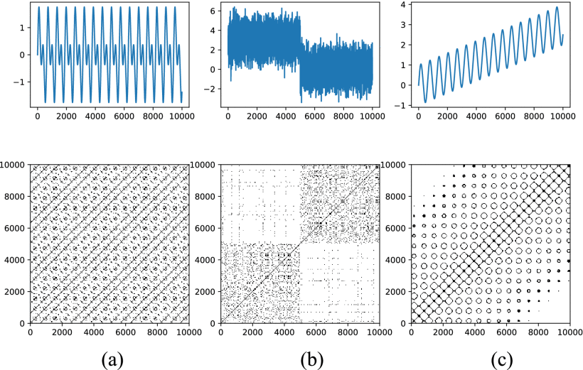

# Background

This page shows scientific background information about the workflow.
Further information is provided in the publication [(Cremer et al. 2020)](https://doi.org/10.1109/JSTARS.2020.3019333).

## Introduction

Tropical forests help stabilize the global climate and protect biodiversity.
Remote sensing technologies, like optical sensors, have been used to monitor these forests, but they struggle with cloud cover, especially during rainy seasons.
Synthetic Aperture Radar (SAR) can penetrate clouds and is used to map forest changes.

SAR data can vary due to environmental conditions, thus using time series data helps improve accuracy.
Current methods for detecting deforestation with Sentinel-1 data fall into two groups: one uses single or few images to detect changes, while the other uses time series to predict changes.
Various techniques, like using radar shadows or Bayesian updating, help identify deforestation.

## Methods

The underlying algorithm is based on Recurrence quantification analysis (RQA).
Hereby, one counts signal change across every possible time point pair.
Recurrence plots visualize all comparisons:

Recurrence plots for (a) the sum of two sine waves with different frequencies, (b) a step function with noise, and (c) a sine wave with trend. (b) shows a deforestation event whereas the other two just show seasonal effects or trends.

A location is considered as deforested if a change was detected often enough (threshold approach).
In particular, the TREND metric is used to make this decision:

$$
\text{TREND}= \frac{\sum _{\tau =1}^{\tilde{N}}(\tau - \tilde{N}/2)(\text{RR}_\tau - \langle \text{RR}_\tau \rangle)}
{\sum _{\tau =1}^{\tilde{N}}(\tau - \tilde{N}/2)}
$$

Hereby, $\tilde{N}$ is the number of time steps and $RR_i$ is the number of recurrent values on the ith diagonal.
It represents the linear regression coefficient over the $RR$ of the diagonals in comparison to their distance to the main diagonal.
It indicates whether the process is drifting or not.
The $TREND$ value is computed for each location individually and reported in the final result data cube.

## Data

Up to now, this algorithm was only applied to Sentinel-1 Sigma Nought backscatter data as processed using [Wagner et al. 2021](https://www.mdpi.com/2072-4292/13/22/4622) in [Equi7Grid projection](https://github.com/TUW-GEO/Equi7Grid).
Using less corrected imagery may be possible but has not been tested yet.

## Parameters

First, the workflow is executed on a given spatiotemporal extent.
The spatial extent doesn't influence the result of individual locations, since neighboring pixels are not considered.
For the Sentinel-1 Sigma Nought dataset in Equi7Grid projection, the area to be analyzed is given as a list of tiles.
The time span should be a multiple of a year to reduce potential seasonal bias.
The algorithm itself can be tuned by setting the threshold value that determines whether to count a time point pair change or not.

| name       | description                                                                       | format                            | example      |
| ---------- | --------------------------------------------------------------------------------- | --------------------------------- | ------------ |
| continent  | Continent ID within Equi7Grid. Part of the spatial extent.                        | one of AF, AN, AS, EU, NA, OC, SA | `EU`         |
| tiles      | tile IDs of the area to be analyzed within Equi7Grid- Part of the spatial extent. |                                   | `E036N075T3` |
| start-date | Start date of the time series to analyze.                                         | ISO 8601: YYYY-MM-DD              | `2024-01-31` |
| end-date   | End date of the time series to analyze.                                           | ISO 8601: YYYY-MM-DD              | `2025-01-31` |
| in-dir     | Path to input directory containing Sentinel-1 Sigma0 tile data                    | directory path                    | `/data/in`   |
| out-dir    | Path to output directory containing the zarr data cubes of TREND metric values    | directory path                    | `/data/out`  |
| access-key | Access key to upload results in AWS S3 or MINIO                                   | string                            | `abcABC123`  |
| secret-key | Secret key to upload results in AWS S3 or MINIO                                   | string                            | `defDEF123`  |
