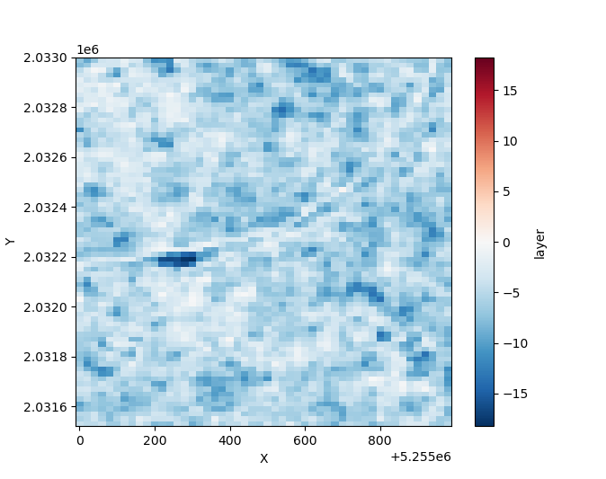

# Overview

In the field of Earth observation science, the implementation of FAIR (Findable, Accessible, Interoperable, and Reusable) workflows are essential for efficient analyses in federated cloud environments that have fast access to the desired large-scale datasets. Here we introduces the FAIRSenDD project, a recent initiative that implements an end-to-end workflow designed for forest change detection across various forest types using Sentinel-1 radar time series data. The primary objective of this project is to demonstrate the efforts required to turn a research algorithm into a FAIR and scalable workflow.

The core algorithm, originally developed in the Julia programming language, leverages Recurrence Quantification Analysis to effectively utilize time series data from Sentinel-1 radar. The algorithm enables horizontal scaling by processing every location individually to distribute the workload across multiple nodes in the cloud environment.

To facilitate accessibility and interoperability, we have developed an interface compliant with the OGC API – Processes standard, enabling seamless integration of the workflow in other workflows. This enables the deployment of the workflow on different Infrastructure as a Service providers towards federated cloud computing. Additionally, a user-friendly web GUI further enhances usability. This ensures that the workflow can be easily deployed as a Software as a Service (SaaS), which can be used by both computers and humans.

Significant efforts have been made to optimize the code for both runtime and memory efficiency. The project adheres to the OGC Best Practice for Earth Observation, resulting in the creation of a portable application package.

## Get Started

Run the latest deforestation detection workflow on a test dataset:

```bash
git clone git@github.com:meggart/RQADeforestationTestData.git
cwltool https://raw.githubusercontent.com/EarthyScience/FAIRSenDD/refs/heads/main/ogc-app-cwl/fairsendd.cwl#cmd-rqa \
    --continent EU \
    --tiles E051N018T3 \
    --start-date 2021-01-01 \
    --end-date 2022-01-01 \
    --in-dir RQADeforestationTestData
```

Access the results e.g. in Python:

```python
import xarray as xr
import matplotlib.pyplot as plt

ds = xr.open_dataset("out.zarr/E051N018T3_rqatrend_VH_D022_thresh_3.0.zarr")
ds.layer.plot()
plt.show()
```



## Citation

The underlying algorithm is based on the following paper:

F. Cremer, M. Urbazaev, J. Cortés, J. Truckenbrodt, C. Schmullius and C. Thiel, "Potential of Recurrence Metrics from Sentinel-1 Time Series for Deforestation Mapping," in IEEE Journal of Selected Topics in Applied Earth Observations and Remote Sensing, vol. 13, pp. 5233-5240, 2020, doi: [10.1109/JSTARS.2020.3019333](https://doi.org/10.1109/JSTARS.2020.3019333).

## Funding

This project was funded by the European Space Agency in the Science Result Long-Term Availability & Reusability Demonstrator Initiative. In addition, this project was supported by the ESA Network of Resources.
